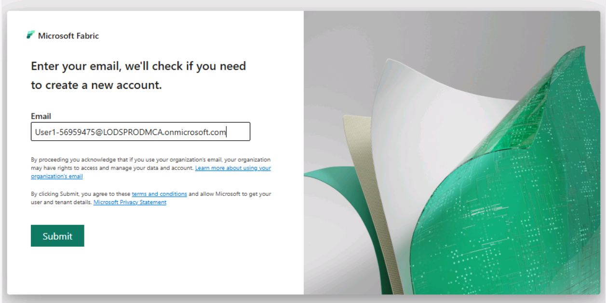
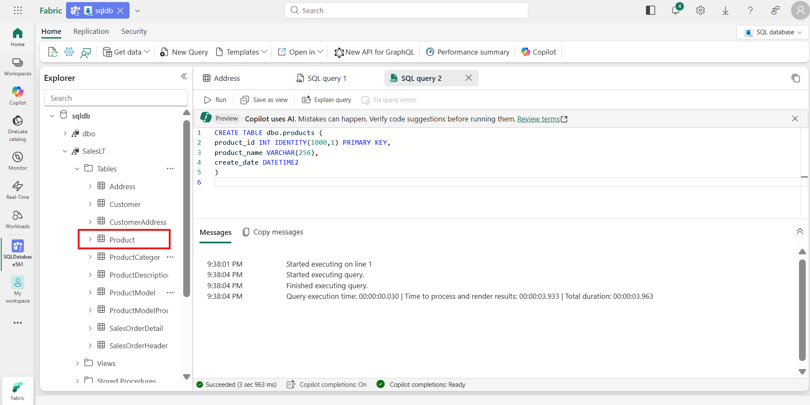
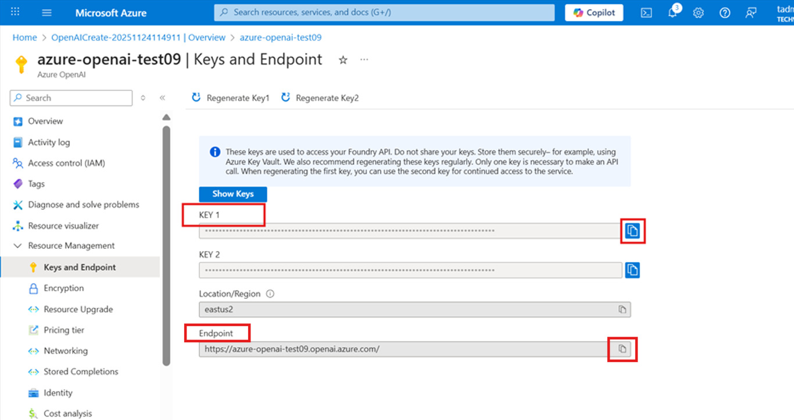
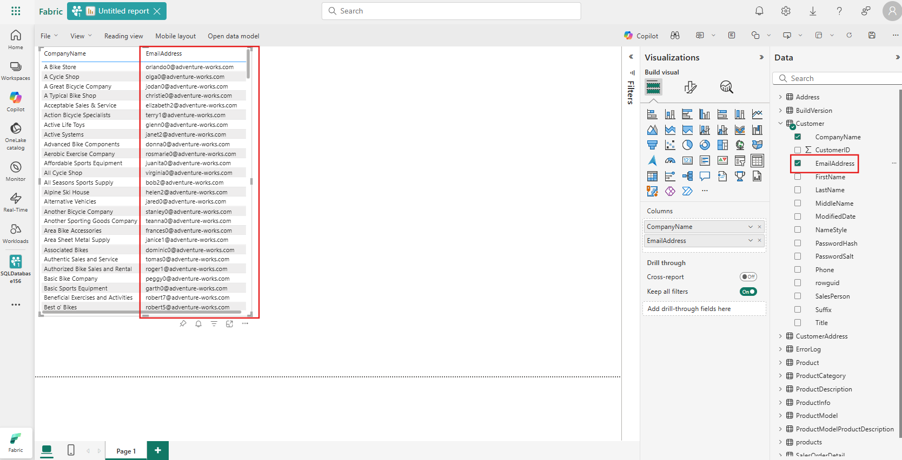
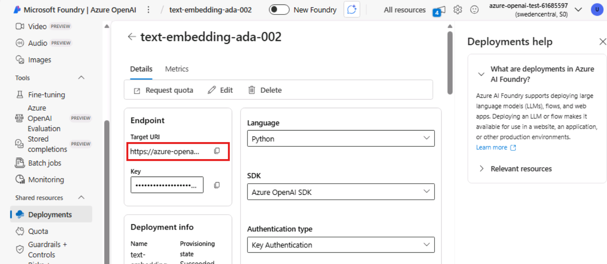
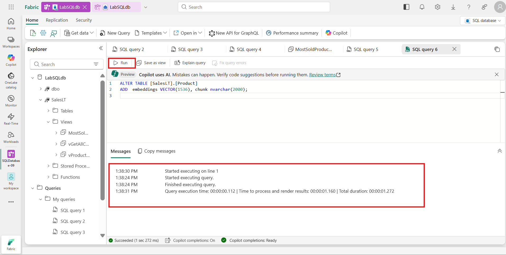

---
lab:
  title: Use Case 1 – Build scalable data solutions with SQL database in Microsoft Fabric
  description: In this section you will create a SQL database and load it with data.
  duration: 182 minutes
  level: 400
  islab: true
  primarytopics:
    - Microsoft Fabric
---

# **Use Case 1 – Build scalable data solutions with SQL database in Microsoft Fabric** 

## **Introduction**

In this Lab, you’ll get hands‑on with the SQL database in Microsoft
Fabric. We'll begin by setting up a Fabric SQL database and loading
sample data followed by trying out the Copilot-assisted querying
(including NL2SQL). From there, you'll learn how to expose your data
through APIs, connect seamlessly to applications, analytics and Power
BI, and explore building Retrieval-Augmented Generation (RAG)
application using SQL database in Microsoft Fabric.

The focus of this lab is to understand how to design, build, and
operationalize end-to-end AI-ready applications using SQL database in
Fabric as the core data backbone.

## **Objectives**

In this lab, you will:

- Create and query a SQL database in Microsoft Fabric.

- Use Copilot to generate and fix SQL queries.

- Build vector embeddings and perform semantic search.

- Integrate Azure OpenAI to create a RAG workflow.

- Expose results through a GraphQL API.

- Build a Power BI report using Copilot in SQL analytics endpoint.

## **Exercise 1 – Setting up the Environment**

### **Task-1: Create a New Fabric Workspace**

In this section of the lab, we will be logging into the Microsoft Fabric
Portal and create a new Fabric Workspace.

1.  Open a web browser and browse to +++https://app.fabric.microsoft.com+++

2.  Sign in using the **email address** and click on **Submit**.

   

3.  Enter **Password** to proceed with the sign in and click on **Sign
    in** button.

   

4.  If prompted to stay signed in, select **Yes**.

   

5.  You’ll be navigated to Microsoft Fabric Home Page. Select **+ New
    workspace**.

   

6.  In the Create a workspace tab, enter the following details and click
    on the **Apply** button.

    - **Workspace name** – Enter +++SQLDatabase-@lab.LabInstance.Id+++

    - **Advanced: Semantic Model storage format -** Small semantic model
    storage format

    - **Advanced: License mode –** Fabric capacity

   
  
   

### **Task-2: Create a SQL Database in Microsoft Fabric**

In this section you will create a SQL database and load it with data.

7.  You’ll be navigated to the workspace page. Click the **New
    item** button on the top left of the page.

   

8.  In the **New item** blade on the right, use the **Filter by item
    type search box** to search for **SQL** and select **SQL database**
    tile.

   

9.  In the **New SQL database** dialog window, enter a unique name as
    +++LabSQLdb+++ for the database and click the **Create button**.

   

10. Once the database is finished creating, you will be taken to SQL
    database's home page.

### **Task-3: Load the database with Sample data**

11. You need some sample data in the database to work with. Click
    the **Sample data** tile right on the database home page to load
    sample data.

   

12. In the upper right corner of the database home page, you will see a
    notification indicating that the data is being loaded into the
    database. 

   

13. Allow this process to run (**about 45-90 seconds**) until you see a
    notification indicating that the data was successfully loaded into
    the database.

   

14. Look at the **Database Explorer** area on the left of the page.
    Here, click the dropdown arrow next to the database to see a list of
    database schemas. Make sure SalesLT sample data is successfully
    loaded in the database.

   

### **Task-4: Working with the SQL database in Microsoft Fabric** 

In this next section, we will be focused on using the Web Editor for SQL
database in Microsoft Fabric.

15. Expand the **SalesLT** schema, followed by expanding
    the **Tables** folder. Then click on the **Address** table.

   

16. After browsing the data in the Address table, click the **New
    Query** button on the toolbar.

   

17. This will open a new query window that we will use to work directly
    with the database. Copy and paste the following code into the query
    window:

    ```
    SELECT * FROM [SalesLT].[Product]
    ```

   

18. Once the code is in the query window, **click the Run button.** You
    will see the **results** of the query on the **bottom of the query
    window**.

   

### **Task-5: Exploring SQL analytics Endpoint** 

With the data from your SQL database automatically mirrored in OneLake,
you can write cross-database queries, joining data from other SQL
databases, mirrored databases, warehouses, and Lakehouses. All this is
currently possible with using T-SQL queries on the SQL analytics
endpoint - a SQL-based experience to analyse OneLake data.

**Important Note: Please refresh the browser before you move to next step.**

19. To access SQL analytics endpoint, switch to **SQL analytics
    endpoint** mode from the top right corner.

   

20. In SQL analytics endpoint, select a **New SQL query**.

   

21. Enter the following code into the query window:

     ```
    SELECT * FROM [SalesLT].[Product]
    ```
  
   

22. Click on **Run** to see the results.

   

23. To switch back to SQL database, select **SQL database** option from
    the top navigation pane.

   

24. Database replication to OneLake can be monitored from the
    replication status of your database. Click **Replication** tab on
    top left corner and select **Monitor replication**.

   

25. This will open up a blade on the right side that demonstrates the
    status and the last mirroring refresh time.

   

26. **Close** the Monitor Replication pane by clicking on the **X**
    icon.

## **Exercise 2 – Copilot Capabilities for SQL database in Microsoft Fabric** 

In this exercise, you will use **Copilot** to assist with T-SQL queries,
including **auto suggestions**, **fixing error**, and **natural language
query** to increase developer efficiency and analyse your data!

### **Task-1: Using Copilot within the query editor** 

In the **Query Editor** you can use T-SQL comments as a way to write
Copilot prompts. After finishing a prompt
press **Enter** or **Space** and Copilot will process your request and
suggest SQL code to complete your query.

1.  Select the **New Query** button on the tool bar as you did in
    previous module.

   

2.  Enter the below prompt in the query editor and press **Enter**.

   +++--Create a query to get the product that is selling the most+++
  
   

3.  Watch for the loading spinner at the bottom of the editor to track
    progress and observe how code suggestion appear in the query window.

   Note:** Copilot responses may not match what is shown in the
   screenshot but will provide similar results.**
  
   

4.  Press the **Tab** key on your keyboard to accept the suggestion.

   

5.  Select the query and click on the **Run** icon.

   

### **Task-2: Copilot Quick Actions within the Query Window**

6.  Select the **New Query** button on the tool bar.

   

7.  Open a new query window and paste the following T-SQL with a syntax
    error and click on the **Run** icon.

    ```
    SELECT c.CustomerID, c.FirstName,c.LastName,
   COUNT(so.SalesOrderID) AS TotalPurchases,
   SUM(so.SubTotal) AS TotalSpent,
   AVG(so.SubTotal) AS AverageOrderValue,
   MAX(so.OrderDate) AS LastPurchaseDate
    FROM
    SalesLT.Customer AS c JOIN SalesLT.SalesOrderHeader AS so ON c.CustomerID = so.CustomerID
    GROUP BY c.CustomerID, c.FName, c.LName ORDER BY TotalSpent DESC;
    ```
  
   

8.  Observe the T-SQL errors (issue) and then select **Fix query errors**.

   

9.  Observe the updated T-SQL along with the comment that clearly states
    where the issue was in the T-SQL.

   

10. Now, click **Run** to see the results without any errors.

   

11. Aside from fixing the T-SQL errors, Copilot can also explain a T-SQL
    to you. Select **Explain query** and Copilot will add comments to
    your T-SQL explaining the T-SQL.

   

### **Task-3: Using Copilot Chat Pane - Natural Language to SQL**

12. Open the **New Query** window.

   

13. Select the **Copilot** option from the Home tab.

   

14. Click on the **Get started** button.

   

15. Paste the following prompt in the **Copilot** chat box and click
    on **Send** button.

   +++Write a query that will return the most sold product.+++
  
   **Note**: Copilot might not show the right results the first time.
   Please ask the same question again.
  
   

16. Read the answer now and select the **Insert** button to input code
    into the query window.

   

17. Click on the **Run** icon and check the **Results**.

   

### **Task-4: Chat Pane - Get results from Copilot**

18. Another way to use Copilot is to ask it to get results for you. Open
    the **New Query** window.

   

19. Paste the following question in the Copilot box and click
    on **Send** button.

   +++What is the most sold product?+++
  
   

20. Observe that Copilot has returned the results in the Chat pane.

   

### **Task-5: Chat Pane – Write (with approval)**

21. Copilot is also able to write and execute queries on top of your
    database (with approval). You can choose **Read and write (with
    approval)** option from the dropdown.

   

22. Paste the following question in the **Copilot** chat box and click
    on **Send** button.

   +++Create a view in the SalesLT schema using this query and execute it.+++
  
   

23. Observe the Copilot's response and select **Run** to execute the
    given query on top of your database.

   

24. Wait a few seconds while Copilot executes the query. It will give a
    confirmation that the view is now created under SalesLT schema.

   

25. In the **Explorer** pane on the left, expand the **SalesLT** schema.
    Open the **Views** folder, then select/click the view you just
    created. Review the displayed results to validate that the data
    matches your expectations.

   

## **Exercise 3 – RAG Architecture Simulation using SQL Database** 

In this exercise, you will explore how vector embeddings and
Retrieval-Augmented Generation (RAG) can be leveraged to generate
intelligent product recommendations.

### **Task-1: Create OpenAI resource in Azure Portal**

1.  Navigate to **Azure portal-** +++https://portal.azure.com/+++. As
    you’re already signed in with the credentials on Microsoft Fabric
    Portal. Your credentials are saved. Just click on **Next** button to
    proceed.

    

2.  You are navigated to Azure Portal Home Page. Search for
    +++OpenAI+++ in the search bar at the top and select it from the
    search results.

   

3.  Click on **Create** dropdown and choose **Azure OpenAI**.

   

4.  Choose **@lab.CloudResourceGroup(ResourceGroup1).Name** as your resource group.

   

5.  Provide the following details:

    - **Region:** @lab.CloudResourceGroup(ResourceGroup1).Location
	- **Name:** +++azure-openai-test-@lab.LabInstance.Id+++

    

6.  Choose the Pricing tier as **Standard S0** and proceed by clicking
    on **Next.**

   

7.  On the **Networking** tab, keep the settings as default and click on
    **Next**.

   

8.  On the **Tags** tab, keep it as is and proceed with the **Next**
    button.

   

9.  Review the **basics** section and click on **Create** to start the
    deployment.

   

10. The deployment is completed. Navigate to **Go to resource.**

   

11. Expand **Resource Management** and select **Key and Endpoint**
    option.

    

12. You can **copy** the **OpenAI key** and **Endpoint** to use it in
    further steps wherever required.

    **Note: Copy and paste the key and Endpoint in the notepad.**

   

### **Task-2: Create Model Deployments- (text-embedding-ada-002 and GPT-4.1)**

13. Navigate to **Overview** tab and **go to Foundry portal.**

    

14. You will be redirected to the Microsoft Foundry Portal. Click **Skip** on the pop-up.

	 
    
15. Select the dropdown at the top and select **View all resources**.

	

16. Select the OpenAI resource and click on **Open in Foundry Classic**.

	
	
18. Scroll down and go to **Deployments** from the left navigation pane.

    

19. Click **‘+ Deploy model’** dropdown and select **Deploy base model.**

   

16. In the model list, search for +++text-embedding-ada-002+++, select it
    and click on **Confirm**.

   

17. Keep the deployment name as it is (**text-embedding-ada-002**) and
    click on **Deploy** button.

   **Note**: If you change the deployment name, you will have to replace
   the name in the further query as well. For this lab, keep the name as
   it is.
  
   

18. Deployment will take 5-10 seconds. When completed, you will see it
    in the list: **embeddings — text-embedding-ada-002 — Succeeded**

   

19. Make sure you copy the **Target URL** for **text-embedding-ada-002**
    model and save in the notepad for the further tasks.

    

20. Deploy the second model – **GPT-4.1**. Select **Deploy base model**
    from the **deploy** **model** dropdown.

    

21. Search for +++gpt-4.1+++ model, select it and click on **Confirm** to
    proceed.

    

22. Make sure **Standard** version is selected for **gpt-4.1** model and
    click on **Deploy**.

    

23. The **gpt-4.1** model deployment is now **succeeded**. Make sure you
    copy the **Target URL** in the notepad for the further tasks.

    

### **Task-3: Setup of database credential**

A database scoped credential is a record in the database that contains
authentication information for connecting to a resource outside the
database. For this task, we will be creating one that contains the api
key for connecting to Azure OpenAI services.

24. Navigate to Microsoft Fabric portal and open **a new query** editor
    window.

   

25. Copy and Paste the below code and click the **Run** button. This
    code is used to create a database scoped credential with Azure
    OpenAI endpoint.

   **Note:** Make sure you replace the OpenAI endpoint and key wherever
   required in the query.
  
    ```
    -- Create a master key for the database
    if not exists(select * from sys.symmetric_keys where [name] = '##MS_DatabaseMasterKey##')
    begin
        create master key encryption by password = N'V3RYStr0NGP@ssw0rd!';
    end
    go

    -- Create the database scoped credential for Azure OpenAI
    if not exists(select * from sys.database_scoped_credentials where [name] = 'https://AI_ENDPOINT_SERVERNAME.openai.azure.com/')
    begin
        create database scoped credential [https://AI_ENDPOINT_SERVERNAME.openai.azure.com/]
        with identity = 'HTTPEndpointHeaders', secret = '{"api-key":"YOUR_OPENAI_KEY"}';
    end
    go
    ```

   
  
   

26. Let's test the connectivity to Azure OpenAI and see the ability to
    call external REST endpoints in action. Copy and paste the following
    code into a blank query editor in Microsoft Fabric:

    **Note:** Replace the gpt-4.1 Target URL in the first line and OpenAI
    Endpoint in the credential

    ```
    declare @url nvarchar(4000) = N'https://AI_ENDPOINT_SERVERNAME.openai.azure.com/openai/deployments/gpt-4/chat/completions?api-version=2024-06-01';
    declare @payload nvarchar(max) = N'{"messages":[{"role":"system","content":"You are an expert joke teller."},                                   
                                    {"role":"system","content":"tell me a joke about a llama walking into a bar"}]}'
    declare @ret int, @response nvarchar(max);

    exec @ret = sp_invoke_external_rest_endpoint
        @url = @url,
        @method = 'POST', 
        @payload = @payload,
        @credential = [https://AI_ENDPOINT_SERVERNAME.openai.azure.com/],    
        @timeout = 230,
        @response = @response output;
        
    select json_value(@response, '$.result.choices[0].message.content') as "Amazing, Awesome, Stupendous Joke";
    ```

    

27. Click the **run** button on the query sheet. The result will be an
    amazing joke you can tell your friends and family!

    **Question:** tell me a joke about a llama walking into a bar.
  
    **Response:** A llama walks into a bar and the bartender says, "Hey,
    why the long face?" The llama replies, "I'm just here to meet my
    alpaca friend, he always packs the good jokes!"
    
    Classic alpaca joke.

    


### **Task-4: Create embeddings for relational data**

An embedding is a special format of data representation that machine
learning models and algorithms can easily use. The embedding is an
information dense representation of the semantic meaning of a piece of
text. Each embedding is a vector of floating-point numbers. Vector
embeddings can help with semantic search by capturing the semantic
similarity between terms. For example, "cat" and "kitty" have similar
meanings, even though they are spelled differently. Embeddings created
and stored in the Azure SQL Database in Microsoft Fabric during this lab
will power a vector similarity search in a chat app you will build.

28. Open a **new query editor** window.  copy and paste the following
    code. This code calls an Azure OpenAI embeddings endpoint. The
    result will be a JSON array of vectors.

    **Note:** Replace the text-embedding-ada-002 target URL in the first
    line of the query and replace the OpenAI endpoint in the credential.

    ```
    declare @url nvarchar(4000) = N'https://AI_ENDPOINT_SERVERNAME.openai.azure.com/openai/deployments/text-embedding-ada-002/embeddings?api-version=2024-06-01';
    declare @message nvarchar(max) = 'Hello World!';
    declare @payload nvarchar(max) = N'{"input": "' + @message + '"}';

    declare @ret int, @response nvarchar(max);

    exec @ret = sp_invoke_external_rest_endpoint 
        @url = @url,
        @method = 'POST',
        @payload = @payload,
        @credential = [https://AI_ENDPOINT_SERVERNAME.openai.azure.com/],
        @timeout = 230,
        @response = @response output;

    select json_query(@response, '$.result.data[0].embedding') as "JSON Vector Array";
    ```

    

29. Again, click the **run** button on the query sheet.

    

30. In a new query sheet or an existing bank one in VS Code, copy and
    paste the following T-SQL:

    ```
    alter table [SalesLT].[Product]
    add  embeddings VECTOR(1536), chunk nvarchar(2000);
    ```

   This code adds a vector datatype column to the Product table. It also
   adds a column named chunk where we will store the text we send over to
   the embeddings REST endpoint.
  
   

31. Then, click the **run** button on the query sheet.

    

32. Next, we are going to use the External REST Endpoint Invocation
    procedure (sp_invoke_external_rest_endpoint) to create a stored
    procedure that will create embeddings for text we supply as an
    input. Copy and paste the following code into a blank query editor
    in Microsoft Fabric:

    **Note: Replace the text-embedding target URL and OpenAI endpoint in the query.**

    ```
    create or alter procedure dbo.create_embeddings
    (
        @input_text nvarchar(max),
        @embedding vector(1536) output
    )
    AS
    BEGIN
    declare @url varchar(max) = 'https://AI_ENDPOINT_SERVERNAME.openai.azure.com/openai/deployments/text-embedding-ada-002/embeddings?api-version=2024-06-01';
    declare @payload nvarchar(max) = json_object('input': @input_text);
    declare @response nvarchar(max);
    declare @retval int;

    -- Call to Azure OpenAI to get the embedding of the search text
    begin try
        exec @retval = sp_invoke_external_rest_endpoint
            @url = @url,
            @method = 'POST',
            @credential = [https://AI_ENDPOINT_SERVERNAME.openai.azure.com/],
            @payload = @payload,
            @response = @response output;
    end try
    begin catch
        select 
            'SQL' as error_source, 
            error_number() as error_code,
            error_message() as error_message
        return;
    end catch
    if (@retval != 0) begin
        select 
            'OPENAI' as error_source, 
            json_value(@response, '$.result.error.code') as error_code,
            json_value(@response, '$.result.error.message') as error_message,
            @response as error_response
        return;
    end
    -- Parse the embedding returned by Azure OpenAI
    declare @json_embedding nvarchar(max) = json_query(@response, '$.result.data[0].embedding');

    -- Convert the JSON array to a vector and set return parameter
    set @embedding = CAST(@json_embedding AS VECTOR(1536));
    END;
    ```
  
   

33. Click the **run** button on the query sheet to create the procedure
    in the database.

    

34. Again, open a new query editor. Run the following T-SQL in a blank
    query editor in Microsoft Fabric to create embeddings for all
    products in the Products table:

    ```
    SET NOCOUNT ON
    DROP TABLE IF EXISTS #MYTEMP 
    DECLARE @ProductID int
    declare @text nvarchar(max);
    declare @vector vector(1536);
    SELECT * INTO #MYTEMP FROM [SalesLT].Product
    SELECT @ProductID = ProductID FROM #MYTEMP
    SELECT TOP(1) @ProductID = ProductID FROM #MYTEMP
    WHILE @@ROWCOUNT <> 0
    BEGIN
        set @text = (SELECT p.Name + ' '+ ISNULL(p.Color,'No Color') + ' '+  c.Name + ' '+  m.Name + ' '+  ISNULL(d.Description,'')
                        FROM 
                        [SalesLT].[ProductCategory] c,
                        [SalesLT].[ProductModel] m,
                        [SalesLT].[Product] p
                        LEFT OUTER JOIN
                        [SalesLT].[vProductAndDescription] d
                        on p.ProductID = d.ProductID
                        and d.Culture = 'en'
                        where p.ProductCategoryID = c.ProductCategoryID
                        and p.ProductModelID = m.ProductModelID
                        and p.ProductID = @ProductID);
        exec dbo.create_embeddings @text, @vector output;
        update [SalesLT].[Product] set [embeddings] = @vector, [chunk] = @text where ProductID = @ProductID;
        DELETE FROM #MYTEMP WHERE ProductID = @ProductID
        SELECT TOP(1) @ProductID = ProductID FROM #MYTEMP
    END
    ```

    

    

35. To ensure all the embeddings were created, run the following code
    and you should get 0 for the result.

    ```
    select count(*) from SalesLT.Product where embeddings is null;
    ```

    

36. Open a new query editor.

   

37. Run the query to see the results of the above update to the Products
    table. You can see that the chunk column is the combination of
    multiple data points about a product and the embeddings column
    contains the vector arrays.

    ```
    select top 10 chunk, embeddings from SalesLT.Product
    ```
  
   
  
   

### **Task-5: Vector Similarity Searching**

Vector similarity searching is a technique used to find and retrieve
data points that are similar to a given query, based on their vector
representations. 

The **VECTOR_DISTANCE** function is a new feature of the SQL Database in
fabric that can calculate the distance between two vectors enabling
similarity searching right in the database. You will be using this
function in samples as well as in the RAG chat application; both
utilizing the vectors you just created for the Products table.

38. The first query will pose the question "**I am looking for a red
    bike and I dont want to spend a lot"**. The key words that should
    help with our similarity search are red, bike, and don’t want to
    spend a lot. **Run** the following SQL in a new query window:

    ```
    declare @search_text nvarchar(max) = 'I am looking for a red bike and I dont want to spend a lot'
    declare @search_vector vector(1536)
    exec dbo.create_embeddings @search_text, @search_vector output;
    SELECT TOP(4) 
    p.ProductID, p.Name , p.chunk,
    vector_distance('cosine', @search_vector, p.embeddings) AS distance
    FROM [SalesLT].[Product] p
    ORDER BY distance
    ```
  
   Results show that the search found exactly that, an affordable red
   bike. The distance column shows us how similar it found the results to
   be using VECTOR_DISTANCE, with a lower score being a better match.
  
   

39. Open a new query window editor. The next search will be looking for
    a safe lightweight helmet. Run the following SQL in a blank query
    editor in Microsoft Fabric:

    ```
    declare @search_text nvarchar(max) = 'I am looking for a safe helmet that does not weigh much'
    declare @search_vector vector(1536)
    exec dbo.create_embeddings @search_text, @search_vector output;
    SELECT TOP(4) 
    p.ProductID, p.Name , p.chunk,
    vector_distance('cosine', @search_vector, p.embeddings) AS distance
    FROM [SalesLT].[Product] p
    ORDER BY distance
    ```
  
   With the results returning lightweight helmets. There is one result
   that is not a helmet but a vest but as you can see, the distance score
   is higher for this result than the 3 helmet scores.
  
   

40. In the previous 2 examples, we were clear on what we were looking
    for; cheap red bike, light helmet. In this next example, we are
    going to have the search flex its AI muscles a bit by saying we want
    a bike seat that needs to be good on trails. This will require the
    search to look for adjacent values that have something in common
    with trails. Run the following SQL in a blank query editor in
    Microsoft Fabric to see the results.

    ```
    declare @search_text nvarchar(max) = 'Do you sell any padded seats that are good on trails?'
    declare @search_vector vector(1536)
    exec dbo.create_embeddings @search_text, @search_vector output;
    SELECT TOP(4) 
    p.ProductID, p.Name , p.chunk,
    vector_distance('cosine', @search_vector, p.embeddings) AS distance
    FROM [SalesLT].[Product] p
    ORDER BY distance
    ```
  
   These results are very interesting for it found products based on word
   meanings such as absorb shocks and bumps and foam-padded. It was able
   to make connections to riding conditions on trails and find products
   that would fit that need.
  
   

41. Create a new stored procedure to find products. Copy and Paste the
    below code in a new **query window** and click Run:

    ```
    create or alter procedure [dbo].[find_products]
    @text nvarchar(max),
    @top int = 10,
    @min_similarity decimal(19,16) = 0.80
    as
    if (@text is null) return;
    declare @retval int, @qv vector(1536);
    exec @retval = dbo.create_embeddings @text, @qv output;
    if (@retval != 0) return;
    with vector_results as (
    SELECT 
            p.Name as product_name,
            ISNULL(p.Color,'No Color') as product_color,
            c.Name as category_name,
            m.Name as model_name,
            d.Description as product_description,
            p.ListPrice as list_price,
            p.weight as product_weight,
            vector_distance('cosine', @qv, p.embeddings) AS distance
    FROM
        [SalesLT].[Product] p,
        [SalesLT].[ProductCategory] c,
        [SalesLT].[ProductModel] m,
        [SalesLT].[vProductAndDescription] d
    where p.ProductID = d.ProductID
    and p.ProductCategoryID = c.ProductCategoryID
    and p.ProductModelID = m.ProductModelID
    and p.ProductID = d.ProductID
    and d.Culture = 'en')
    select TOP(@top) product_name, product_color, category_name, model_name, product_description, list_price, product_weight, distance
    from vector_results
    where (1-distance) > @min_similarity
    order by    
        distance asc;
    GO
    ```
  
   

42. Next, you need to encapsulate the **STORED PROCEDURE** into a
    wrapper so that the result set can be utilized by our GraphQL
    endpoint. Using the **WITH RESULT SET** syntax allows you to change
    the names and data types of the returning result set. This is needed
    in this example because the usage of
    sp_invoke_external_rest_endpoint and the return output from extended
    stored procedures

   Copy and Paste the below code and click Run:
  
    ```
    create or alter procedure [find_products_api]
    @text nvarchar(max)
    as 
    exec find_products @text
    with RESULT SETS
    (    
        (    
            product_name NVARCHAR(200),    
            product_color NVARCHAR(50),    
            category_name NVARCHAR(50),    
            model_name NVARCHAR(50),    
            product_description NVARCHAR(max),    
            list_price INT,    
            product_weight INT,    
            distance float    
        )
    )
    GO
    ```
  
   

43. You can test this newly created procedure to see how it will
    interact with the GraphQL API by running the following SQL in a
    blank query editor in Microsoft Fabric:

    ```
    exec find_products_api 'I am looking for a red bike'
    ```

   

Congratulations! In this exercise, you learned how to build a RAG
application using SQL database in fabric, and Azure OpenAI. You explored
generating vector embeddings for relational data, performing semantic
similarity searches with SQL.

## **Exercise 4 – Build GraphQL API for RAG Applications**

In this exercise, you will be deploying a GraphQL API that uses
embeddings, vector similarity search, and relational data to return a
set of products that could be used by a chat application leveraging a
Large Language Model (LLM). You will create a stored procedure that will
be used by the GraphQL API for taking in questions and returning
products.

### **­Task-1: Chat Completion**

Let's create a new stored procedure to create a new flow that not only
uses vector similarity search to get products based on a question asked
by a user, but to take the results, pass them to Azure OpenAI Chat
Completion, and craft an answer they would typically see with an AI chat
application.

1.  Open a new query window editor.

   

2.  The first step in augmenting our RAG application API is to create a
    stored procedure that takes the retrieved products and passes them
    in a prompt to an Azure OpenAI Chat Completion REST endpoint. The
    prompt consists of telling the endpoint who they are, what products
    they have to work with, and the exact question that was asked by the
    user.

    Copy/Paste the below T-SQL Code in a new query window and Run the code:

    ```
    CREATE OR ALTER PROCEDURE [dbo].[prompt_answer]
    @user_question nvarchar(max),
    @products nvarchar(max),
    @answer nvarchar(max) output

    AS

    declare @url nvarchar(4000) = N'https://AI_ENDPOINT_SERVERNAME.openai.azure.com/openai/deployments/gpt-4/chat/completions?api-version=2024-06-01';
    declare @payload nvarchar(max) = N'{
        "messages": [
            {
                "role": "system",
                "content": "You are a sales assistant who helps customers find the right products for their question and activities."
            },
            {
                "role": "user",
                "content": "The products available are the following: ' + @products + '"
            },
            {
                "role": "user",
                "content": " ' + @user_question + '"
            }
        ]
    }';

    declare @ret int, @response nvarchar(max);

    exec @ret = sp_invoke_external_rest_endpoint
        @url = @url,
        @method = 'POST', 
        @payload = @payload,
        @credential = [https://AI_ENDPOINT_SERVERNAME.openai.azure.com/],    
        @timeout = 230,
        @response = @response output;

    select json_value(@response, '$.result.choices[0].message.content');

    GO
    ```

   
  
   

3.  Now that you have created the chat completion stored procedure, we
    need to create a new **find_products_chat** stored procedure that
    adds a call to this chat completion endpoint.

    Copy/Paste the below T-SQL Code in a new query window and Run the code:
  
    ```
    create or alter procedure [dbo].[find_products_chat]
    @text nvarchar(max),
    @top int = 3,
    @min_similarity decimal(19,16) = 0.70
    as
    if (@text is null) return;
    declare @retval int, @qv vector(1536), @products_json nvarchar(max), @answer nvarchar(max);
    exec @retval = dbo.create_embeddings @text, @qv output;
    if (@retval != 0) return;
    with vector_results as (
    SELECT 
            p.Name as product_name,
            ISNULL(p.Color,'No Color') as product_color,
            c.Name as category_name,
            m.Name as model_name,
            d.Description as product_description,
            p.ListPrice as list_price,
            p.weight as product_weight,
            vector_distance('cosine', @qv, p.embeddings) AS distance
    FROM
        [SalesLT].[Product] p,
        [SalesLT].[ProductCategory] c,
        [SalesLT].[ProductModel] m,
        [SalesLT].[vProductAndDescription] d
    where p.ProductID = d.ProductID
    and p.ProductCategoryID = c.ProductCategoryID
    and p.ProductModelID = m.ProductModelID
    and p.ProductID = d.ProductID
    and d.Culture = 'en')
    select
    top(@top)
    @products_json = (STRING_AGG (CONVERT(NVARCHAR(max),CONCAT( 
                                    product_name, ' ' ,
                                    product_color, ' ',
                                    category_name, ' ', 
                                    model_name, ' ', 
                                    product_description, ' ',
                                    list_price, ' ',
                                    product_weight )), CHAR(13)))
    from vector_results
    where (1-distance) > @min_similarity
    group by distance
    order by    
        distance asc;

    set @products_json = (select REPLACE(REPLACE(@products_json, CHAR(13), ' , '), CHAR(10), ' , '));

    exec [dbo].[prompt_answer] @text, @products_json, @answer output;

    GO
    ```
  
   
  
   

4.  The last step before we can create a **GraphQL** endpoint is to wrap
    the new find products chat stored procedure. Copy/Paste the below
    T-SQL Code in a new query window and Run the code:

    ```
    create or alter procedure [find_products_chat_api]
    @text nvarchar(max)
    as 
    exec find_products_chat @text
    with RESULT SETS
    (    
        (    
            answer NVARCHAR(max)
        )
    )
    GO
    ```
  
   

5.  You can test this new procedure to see how Azure OpenAI will answer
    a question with product data. Copy/Paste the below T-SQL Code in a
    new query window and Run the code:

    ```
    exec find_products_chat_api 'I am looking for a red bike'
    ```

   

### **Task-2: Create GraphQL API**

6.  To create the GraphQL API, click on the **New API for
    GraphQL** button on the toolbar.

   

7.  In the **New API for GraphQL** dialog box, use the **Name
    Field** and name the API +++find_products_chat_api+++. After
    naming the API, click the **Create** button.

   

8.  Choose the stored procedure in the results. You can ensure it is
    the **find_products_api** stored procedure by hovering over it
    with your mouse/pointer. It will also indicate the selected database
    item in the preview section. It should state "**Preview data:
    dbo.find_products_api**". Click on **Load** button.

   

9.  You will now be on the **GraphQL Query editor page**. Copy/Paste the
    below code in the GraphQL query editor.

    ```
    query {
    executefind_products_api(text: "I am looking for a red bike") {
            product_name
            product_color
            category_name
            model_name
            product_description
            list_price
            product_weight
            distance 
        }
    }
    ```

   
  
   

The API you just created could now be handed off to an application
developer to be included in a RAG application that uses vector
similarity search and data from the database.

Congratulations!! In this exercise, you learned how to build a RAG
application using SQL database in fabric, and Azure OpenAI. You explored
generating vector embeddings for relational data, performing semantic
similarity searches with SQL, and integrating natural language responses
via GPT-4.1.

## **Exercise 5 – Create a Power BI Report from a SQL analytics endpoint in Microsoft Fabric with Copilot**

In this exercise, you'll learn how to leverage the power of Microsoft
Fabric's integrated analytics capabilities to create compelling Power BI
reports using Copilot assistance. This module demonstrates the seamless
connection between SQL database in Fabric and Power BI reporting through
SQL analytics endpoints.

It's easy to quickly create reports in Power BI with SQL analytics
endpoint in Fabric using Copilot.

### **Task-1: Build a new report with Copilot** 

1.  Navigate to **SQL analytics endpoint** from the top navigation pane.


2.  On the SQL database analytics endpoint details page, **click the New
    semantic model** from the ribbon.


3.  When the **New semantic model** window opens, enter the
    name +++**product_insight**+++, complete the **workspace details**,
    and click **select all** tables to create the semantic model. Click
    on **Confirm** to proceed.

**\[IMPORTANT\] If tables are not visible. Click Refresh icon next to
Search bar.**


4.  Click on the workspace and look for the newly created **semantic
    model - product_insight**. Select the **product_insight** semantic
    model.

    

5.  Navigate to **File** and select **Create new report** option.

    

6.  Click on **Copilot**. On the **right side** of the page,
    the **Copilot blade** opens.

    

7.  Click on the **Get Started** button.

    

8.  Copilot presents some questions to get you started. Click **Suggest
    content for a new report page**.

    

9.  Suggested outlines for your report are returned by Copilot based on
    the data it has access to in the analytics endpoint.

    

10. You can review the selections by **expanding their cards** to see a
    quick description about the report.

11. Click the **Create button** for the **Customer
    Demographics** report **or any other report** you would like to
    create.

   

12. Copilot will then begin **creating your report**.

   

13. You now have a Power BI report of your SQL database data!

    

## **Conclusion**

Congratulations on successfully completing a comprehensive hands-on
journey in building scalable, AI-ready data solutions using SQL Database
in Microsoft Fabric. This lab offered an end-to-end experience in
designing, building, and operationalizing modern data solutions,
covering key areas such as an introduction to SQL Database in Fabric,
exploring Copilot capabilities for SQL Database, implementing
Retrieval-Augmented Generation (RAG) with Azure OpenAI, developing
GraphQL APIs for RAG applications, and creating insightful Power BI
reports using semantic models.
